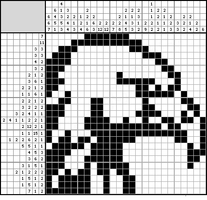
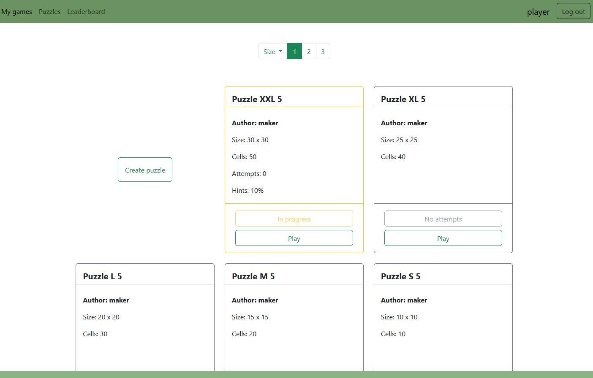
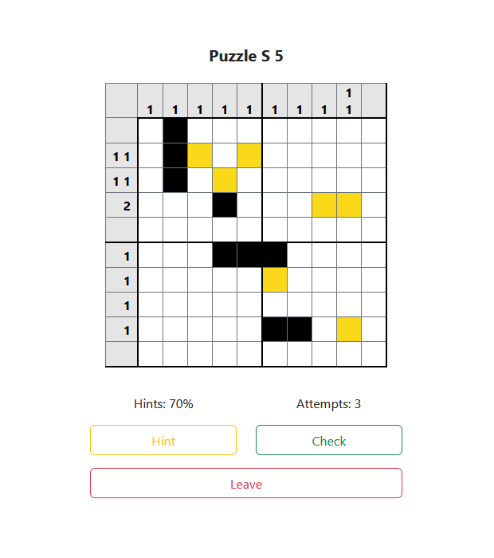
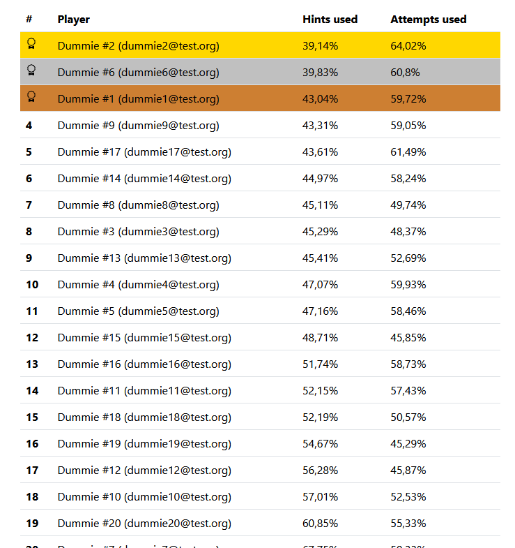

# Nonogram

#### v 0.7

### by Andrii Lozychenko

#

This is my personal project designed to demonstrate my skills. I also use it to
learn and practice technologies and improve myself as a software engineer.

My project is based on the Japanese puzzle Nonogram, where you need to draw a picture “pixel by pixel” using clues.

## Tech stack

* Java 17
* Spring Boot 3.2.1
* Spring Framework
    * Core
    * Data
    * Security
    * MVC
* JPA / Hibernate
* PostgreSQL
* FlyWay
* FreeMarker
* HTML, CSS, JS, Bootstrap 5.3
* OAuth2

## About project

The main idea of the project is to create a gaming space where players will have the opportunity to both create their
own puzzles
and play existing ones created in different ways - manually, generated by a pseudo-random generator
or by converting an uploaded picture.

### Showcase
* User CRUD
  * Self-edit
    * Create manually or with Google
    * Edit
    * Display profile
    * Delete
  * Admin-edit
    * Block / Unblock
    * Change role
    * List users
* Puzzle CRUD
  * Create manually
  * Rename
  * Delete
* Game
  * Check answer
  * Give a hint
  * Saving game state
  * Leaderboard
* Security
  * Access by role
  * Puzzle operations for puzzle owners only
  * User's profile operations for self-editing only
* Validation
  * **Hibernate / Jakarta** validators
  * Custom validators
    * PasswordConfirmation
    * StrongPassword
    * UniqueEmail
    * UniquePuzzleName
  * Validators grouping
* Data
  * **Entity - Repository - Service** design pattern
  * **FlyWay** migration scripts
* Front-end
  * Common parts of pages are divided into **FreeMarker**'s macros

## Planned Features
- [ ] Puzzle
  - [ ] Generate puzzle with a pseudo-random algorithm
  - [ ] Generate puzzle by a uploaded picture
  - [ ] Colored puzzles
  - [ ] Puzzle list's filters, search and sort
  - [ ] Rating
- [ ] Move "heavy" generation processes to a separate app and join them with a message broker (probably **Apache Kafka**)
- [ ] **OpenAPI 3.0 / Swagger**
- [ ] User's profile customization 
  - [ ] Profile picture
  - [ ] Player's stats
- [ ] Tests
  - [ ] Unit tests
  - [ ] Integration tests
- [ ] Front-end
  - [ ] Add more design
  - [ ] "How to play" guide